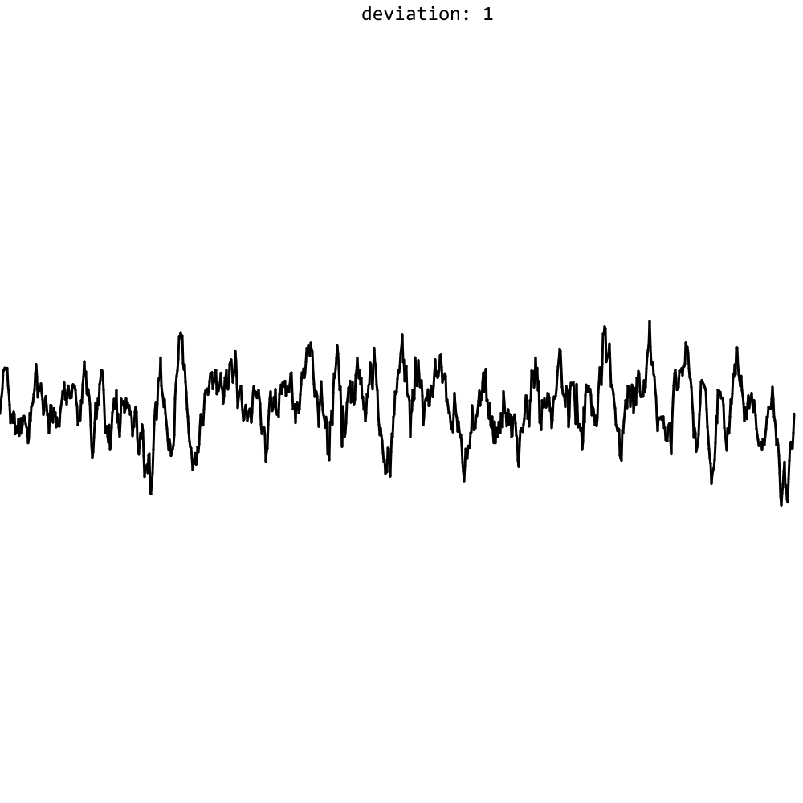

# Pace Graph Builder

This program simulates pace computing and averaging algorithm. Data is displayed graph in different time points

Prerequisities:

```cmd
go get -u github.com/fogleman/gg
go get -u gonum.org/v1/gonum/
```

### Demo:

